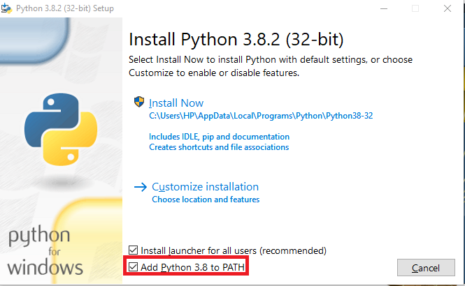

# KoronaScience: kurs z podstaw Data Science w Pythonie

## Instalacja (Windows)

**W razie jakichkolwiek problemów z instalajcą proszę o otworzenie [_Issue_](https://github.com/RouNNdeL/korona-science/issues/new) w tym repozytorium
i opisanie (najlepiej z obrazkami) problemu, postaramy się jak najszybciej pomóc, żeby każdy mógł wziąć udział 
w zajęciach.**

Rozpoczynamy od pobrania Pythona z [oficjalnej strony](https://www.python.org/downloads/).


Po uruchomieniu pliku `python-3.X.X.exe` otworzy się instalator. 



**WAŻNE: Zaznaczamy opcję _Add Python to PATH_**

Jeśli **nie** mamy uprawnień Administratora odznaczamy opcję _Install launcher for all users_.
Następnie klikamy __Install now__.

Jeśli instalacja przebiegła pomyślnie powinniśmy zobaczyć następujące okienko. 


Warto również wyłączyć limit długości ścieżek (wymagane uprawnienia administratora). Klikamy _Disable path length limit_.

Po zakończeniu możemy zamknąć instalator.

Następnie uruchamiamy wiersz polecenia (`cmd`), wyszukując go w Menu Start.


Jeśli instalacje przeprowadziliśmy z uprawnieniami Administratora należy uruchomić wiersz polecenia jako Administrator. 
 Wszystkie polecenia wpisywane do konsoli zatwierdzamy Enterem.
Możemy teraz zweryfikować czy instalacja przebiegła pomyślnie.

Wpisujemy `python --version` a następnie `pip3 --version`. 


Jeśli otrzymujemy błąd 

```
python is not recognized as an internal or external command,
operable program or batch file.
```

należy zrestartować komputer. Jeśli to nie pomoże należy dodać Pythona do zmiennej środowiskowej _PATH_. 
[How to add Python to PATH](https://geek-university.com/python/add-python-to-the-windows-path/)

Jeśli wszytsko działa instalujemy Jupyter za pomocą polecenia `pip3 install jupyter`. Instalacja może zająć kilka minut.


Zostawiamy na razie otwarty wiersz polecenia z uprawnieniami Administratora i otiweramy kolejny bez uprawnień.

Uruchamiamy serwer Jupyter za pomocą polecenia `jupyter notebook`.
Ścieżka w której się teraz znajdujemy (domyślnie folder użytkownika na dysku C) zostanie użyta jako ścieżka głowna w Jupyter.


Po wykonaniu polecenia powinna automatycznie otworzyć się przeglądarka, jeśli tak się nie stanie, 
kopiujemy wyświetlony link do paska URL przeglądarki (kopiowanie w wierszu za pomocą prawego przycisku myszy, Ctrl+C zamyka program).

**Nie zamykamy wiersza polecenia, spowoduje to zatrzymanie serwera**

W przeglądarce powinna wyświetlić się następująca strona: 


Jeśli do tej pory wszystko zrobiliśmy dobrze, to powinniśmy widzieć katalogi w swoim folderze domowym.
Należy teraz utowrzyć nowy folder (w dowolnym miejscu, ale pamiętajmy gdzie). 


Następnie tworzymy nowy Notebook


Możemy przetestować działanie.


Wcześniej zostawiliśmy otwarte okno wiersza polecenia z uprawnienami Administratora. 
Należy teraz zainstalować kilka podstawowych modułów potrzebnych na zajęcia.
`pip3 install numpy plotly matplotlib pandas`


Poźniej w trakcie zajęć prowadzący może poprościć o zainstalowanie kolejnych modułów. 
Robimy to tak samo jak w przypadku modułu `jupyter` oraz innych za pomocą polecenia `pip3 install`
